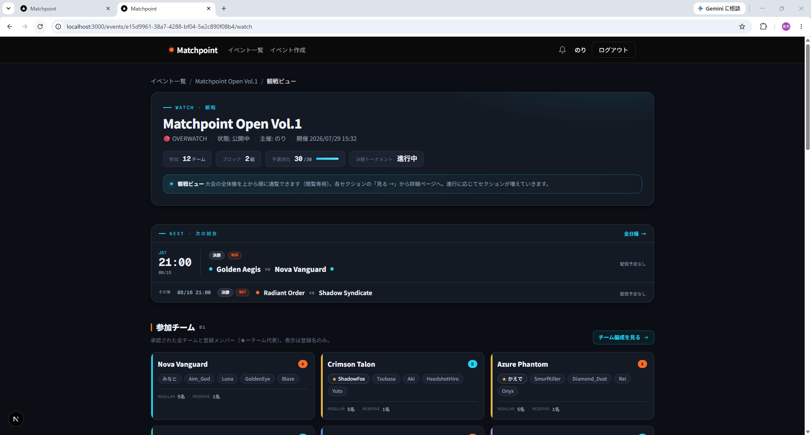
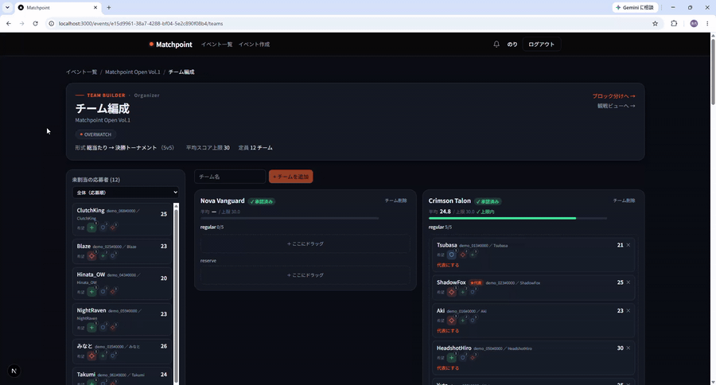
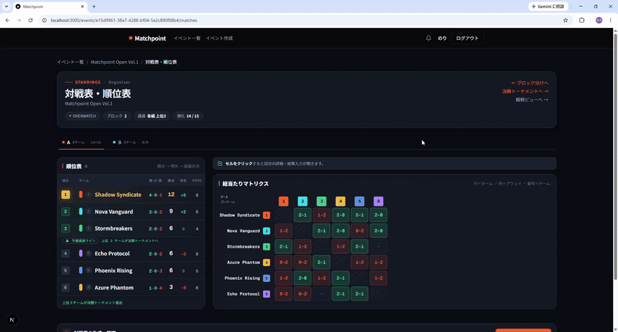
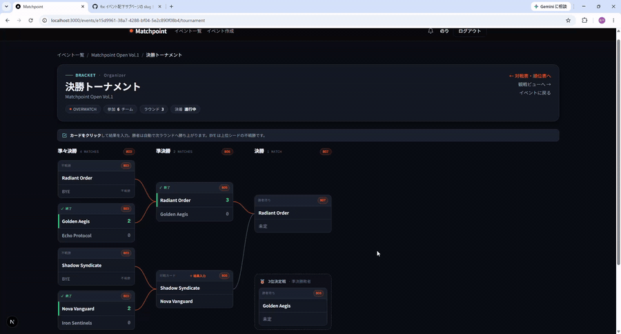
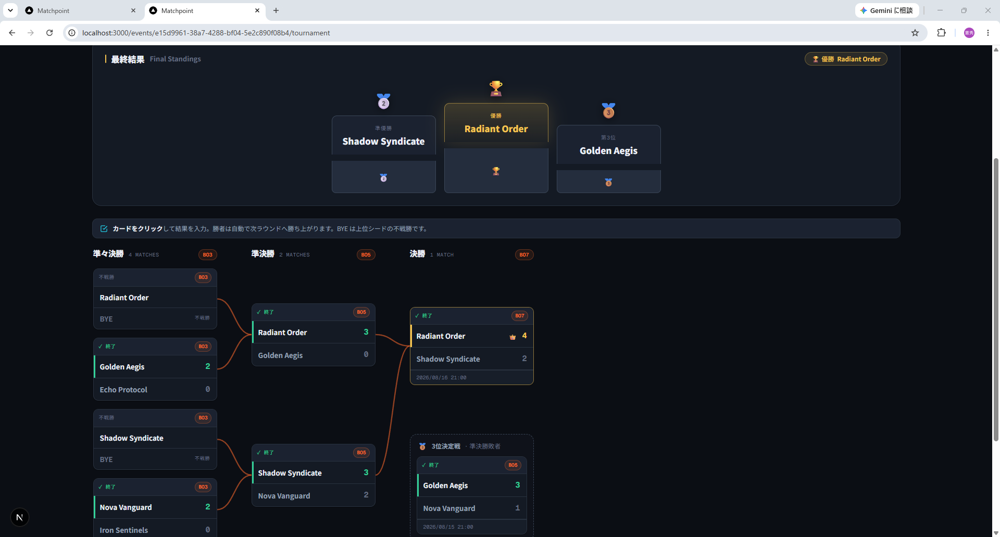
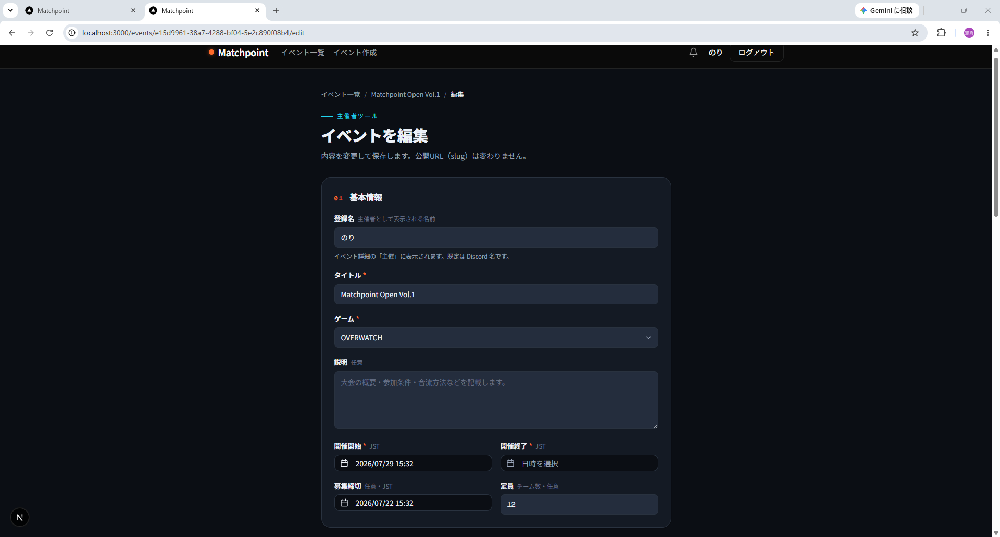
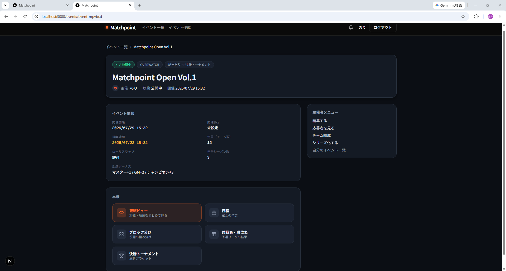

# Match Point（GameEventBoard）

🔗 **Live Demo**: https://game-event-board.vercel.app

**FPSタイトル（Overwatch）のコミュニティ大会**を、主催・参加・観戦のすべての立場から支えるイベント管理プラットフォーム。
スコア均衡したチーム分けから、予選ブロック・総当たり・順位表・決勝トーナメントの進行、Discord 連携通知、
そして非ログインでも追える観戦ビューまでを 1 つのアプリで完結させる。

> 個人開発（フルスタック）。設計・実装・DB 設計・セキュリティまで一貫して担当。
> 設計ドキュメントは [`docs/`](./docs) に集約（要件定義書 / DB設計書 / ER図 / アーキテクチャ設計書 / 実装ガイドライン）。



---

## 解決する課題

FPS（主に Overwatch）のコミュニティ大会は、運営が Discord とスプレッドシートを手作業で行き来して回している。
参加者のランク申告からの**戦力均衡したチーム分け**、対戦カードの生成、結果集計と順位表、日程の周知——
このどれもが煩雑で属人的になりやすい。GameEventBoard はこの一連の運営フローをアプリ 1 つに集約し、
さらに**観戦者が大会の今を追える**ことで盛り上げまで支援する。

---

## デモ

このアプリの価値は**動的な操作**にある。手作業で属人的だった運営フローを、その場で完結できる。

### チーム編成：ドラッグ&ドロップで戦力均衡

メンバーをチーム間でドラッグすると、チーム平均スコアが即座に再計算され、**スコア上限の超過が視覚的に警告**される。
交代シミュレーション（保存せず試算）で、均衡の取れた組み合わせを試行錯誤できる。



### 総当たり表：結果入力 → 順位が自動で動く

対戦表にスコアを入力すると、多段タイブレークで**順位表が即座に更新**される。手作業の集計が要らない。



### 決勝トーナメント：勝敗入力で勝者が自動進出

ブラケットに結果を入れると、勝者が次のラウンドへ自動で進む。修正が下流に伝播し、表彰台まで確定する。



### 観戦ビュー：大会の全体像を1ページで

参加チーム・予選ブロック・順位表・試合結果・決勝トーナメント・次の試合を、**非ログインでも**1ページで通覧できる観戦者向けダッシュボード。主催者が結果を入力すると、開いている観戦画面は**リロードなしでライブ更新**される（Supabase Realtime）。


> 撮影対象・手順は [`docs/screenshots/README.md`](docs/screenshots/README.md) を参照。

---

## 主要機能

### 主催者
- **イベント作成・公開**：開催形式（総当たり／トーナメント／総当たり→決勝T）・BO 設定・順位設定（勝点／タイブレーク）・定員をフォームで設定。公開後も編集可（定員は既存応募者を締め出さないよう下限を保護）。
- **スコアリング**：応募者のランク申告（ロール×シーズン）から個人スコアをサーバー側で算出。未認定ロールの補完方式・到達ボーナス・チームスコア上限をイベントごとにカスタマイズ。
- **チーム編成**：承認済み応募者を D&D でチーム分け。交代シミュレーション（保存せず試算）。
- **予選ブロック分け**：スネークドラフトによる**自動振り分け**＋手動 D&D 微調整。
- **本戦進行**：総当たり対戦カードの自動生成 → 結果入力 → 多段タイブレークによる順位表 → 各ブロック上位 N の**決勝トーナメント**（シングルエリミ・3位決定戦・BYE・表彰台）。
- **試合の付随情報**：日時（JST）・配信 URL／配信者・マップ別リプレイコードを試合に紐付け。

### 参加者
- **応募**：スコアあり／なしの両フロー。登録名（公開表示名）・希望ロール・ランクグリッドを入力。
- **自チーム編成**：代表がチームを組んで申請 → 主催者が承認。
- **スクリム管理**：チーム単位で練習試合をカレンダー管理（運営は閲覧のみ・不干渉）。

### 観戦者（非ログイン可）
- **観戦ビュー**（`/events/[id]/watch`）：参加チーム・ブロック・予選順位・試合結果・決勝トーナメント・**次の試合**を 1 ページで通覧。
- **ライブ更新**：主催者が結果を入力した瞬間、順位表・結果・次の試合が**リロードなしで更新**（Supabase Realtime）。

### 通知（アプリ内＋Discord）
- **フォロー**：イベント／シリーズ／ユーザーをフォロー。
- **アプリ内通知**：ヘッダーの 🔔 と一覧ページ。Realtime で未読が即反映。
- **Discord 連携**：イベント公開の全体告知（Webhook）と、個人宛リマインド（Bot DM）。Cron による試合直前・当日通知。
- **シリーズ**：継続開催（例: 週次リーグ）をシリーズとしてまとめ、共同運営（owner／admin）を招待制で管理。

---

## 画面ギャラリー

**決勝トーナメント**（シード・BYE・3位決定戦・表彰台）



**イベント作成フォーム**（開催形式・BO・順位設定・スコアリングを細かく設定）



**イベント詳細**



---

## 技術スタック

| レイヤー | 採用 | 補足 |
|---|---|---|
| フロント／API | **Next.js (App Router) + TypeScript** | Server / Client Components を使い分けるフルスタック構成 |
| スタイル | **Tailwind CSS v4 + shadcn/ui** | デザインシステム `.theme-matchpoint`（[docs/DESIGN.md](docs/DESIGN.md)） |
| DB／認証／Realtime | **Supabase (PostgreSQL)** | RLS・Discord OAuth・Realtime が一体 |
| バリデーション | **Zod** | 入力検証を型と一体で担保 |
| D&D | **dnd-kit** | チーム編成・ブロック分け・タイブレーク並べ替え |
| テスト | **Vitest** | 純粋ロジック（スコア／順位／ブラケット）を中心に **387 テスト** |
| ホスティング | **Vercel** | git push で自動ビルド＆デプロイ |

> Docker 不要。Vercel が git push でビルド&デプロイを、Supabase が DB をマネージドで提供する。
> ローカルでも `npm run dev` がクラウド Supabase に直接つなぐ。

---

## 設計のこだわり（技術的な見どころ）

### 多層防御のセキュリティ
- **認可は 2 段構え**：操作系の Server Action は「アプリ層のログイン・所有者確認」＋「DB 層の RLS」で二重に守る。閲覧系は RLS を主役に公開範囲を制御（公開イベントは匿名にも開放・下書きは主催者のみ）。
- **マスアサインメント対策**：Zod で許可カラムのみ受理。スコア・勝者・`organizer_id`・`status` 等はすべて**サーバー側で確定**し、入力から取らない。
- **security definer 関数の直叩き対策**：RLS を跨ぐ関数は actor を `auth.uid()` で取得し、不要な `EXECUTE` を `anon` から `REVOKE`。REST 直叩きによる権限昇格を実際に再現・検証して塞いだ（[docs/DB設計書.md](docs/DB設計書.md) 6章）。
- **XSS**：React の自動エスケープに委ね、`dangerouslySetInnerHTML` は不使用。配信 URL は `href` に出す前に http/https のみ許可。

### レイヤー構造
Controller（薄い Server Action）→ Service（純粋ロジック）→ Repository（Supabase アクセス）の 3 層。
複雑なドメインロジック（個人スコア算出・順位の多段タイブレーク・トーナメントのブラケット再計算・スネークドラフト）は
副作用のない純粋関数として Service に切り出し、Vitest で重点的にテストしている。

### リアルタイム更新の設計
WebSocket（Supabase Realtime）は「**変わった**」というシグナルとしてのみ使い、描画は既存の Server Component に
`router.refresh()` で任せる。差分を手で組み立てず、表示は常に DB の真値。RLS が公開範囲を尊重するため、
匿名観戦者にも公開イベントの変更だけが届く。

### 型安全
`supabase gen types typescript` で DB スキーマから TypeScript 型を生成し、クエリの戻り値に型を効かせる
（ORM を足さずに Prisma に近い型安全を得る）。

---

## セットアップ

### 1. 依存インストール
```bash
npm install
```

### 2. Supabase プロジェクトを用意
1. https://supabase.com でプロジェクトを作成（無料枠でよい）。
2. ダッシュボード > Project Settings > API から URL・anon キー・service_role キーを取得。
3. SQL Editor で [`supabase/migrations/`](./supabase/migrations) 配下の `.sql` を **`0001` から番号順にすべて実行**する（スキーマ・RLS ポリシー・security definer 関数・Realtime 有効化まで含む。番号は依存順なので順序を守る）。
4. Authentication > Providers で **Discord** を有効化（OAuth クライアントIDとシークレットを設定）。リダイレクト URL に `<APP_URL>/auth/callback` を登録する。

### 3. 環境変数
`.env.local.example` を `.env.local` にコピーして値を埋める。
```bash
cp .env.local.example .env.local
```
必要な変数は `.env.local.example` にコメント付きで記載（Supabase 接続情報のほか、Discord Bot トークン・アプリ公開 URL・Cron シークレットは任意機能用）。

### 4. 開発サーバー
```bash
npm run dev
```
http://localhost:3000 を開く。

---

## 開発コマンド

```bash
npm run dev        # 開発サーバー
npm run build      # 本番ビルド
npm run check      # lint + typecheck + test（コミット前の一括チェック）
npm run test       # Vitest（watch）
npm run typecheck  # tsc --noEmit
```

---

## ディレクトリ構成（抜粋）

```
docs/                         設計ドキュメント（要件定義 / DB設計 / ER図 / アーキテクチャ / devlog）
  archive/                    役目を終えた作業メモの保管
  design-refs/                各画面のデザイン参照 HTML
src/app/                      Next.js App Router（画面＋ Server Actions）
src/components/               共通 UI・matchpoint コンポーネント
src/lib/services/             純粋ロジック（スコア / 順位 / ブラケット / スネークドラフト …）
src/lib/repositories/         Supabase データアクセス層
src/lib/notifications/        通知（アプリ内 / Discord Webhook / Bot DM / Cron）
src/lib/supabase/             Supabase クライアント（client / server / admin）＋生成型
supabase/migrations/          DB マイグレーション SQL（スキーマ・RLS・definer 関数・Realtime）
```

---

## デプロイ（Vercel）

Vercel にリポジトリを接続し、環境変数を設定すれば git push で自動デプロイされる。

- 必須：`NEXT_PUBLIC_SUPABASE_URL` / `NEXT_PUBLIC_SUPABASE_ANON_KEY` / `SUPABASE_SERVICE_ROLE_KEY`
- 任意（機能有効化時）：`DISCORD_BOT_TOKEN`（個人宛 DM）/ `NEXT_PUBLIC_APP_URL`（通知内リンクの絶対 URL）/ `CRON_SECRET`（定期通知エンドポイントの保護）

Supabase 側は「セットアップ」と同じマイグレーション適用・Discord OAuth 設定が本番プロジェクトにも必要。
