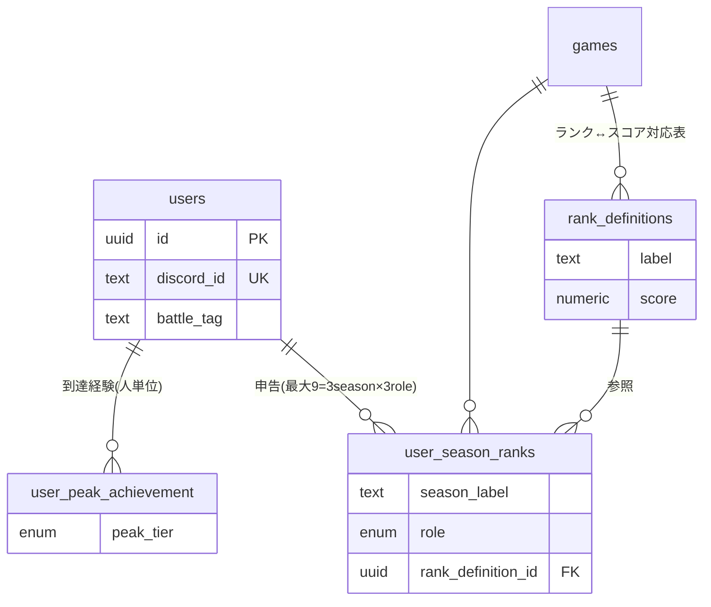
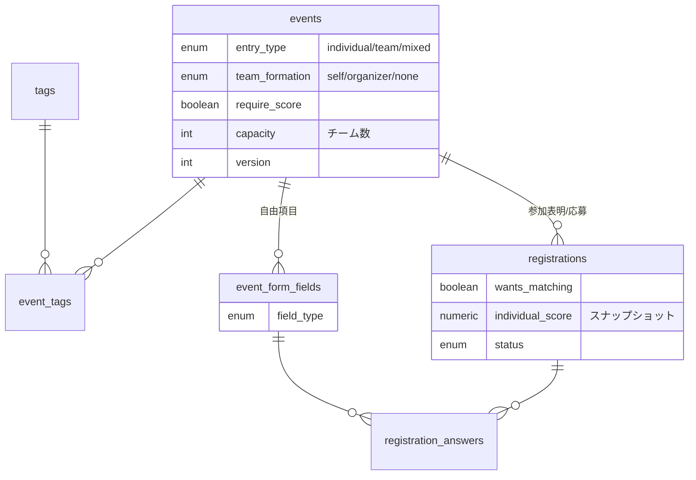
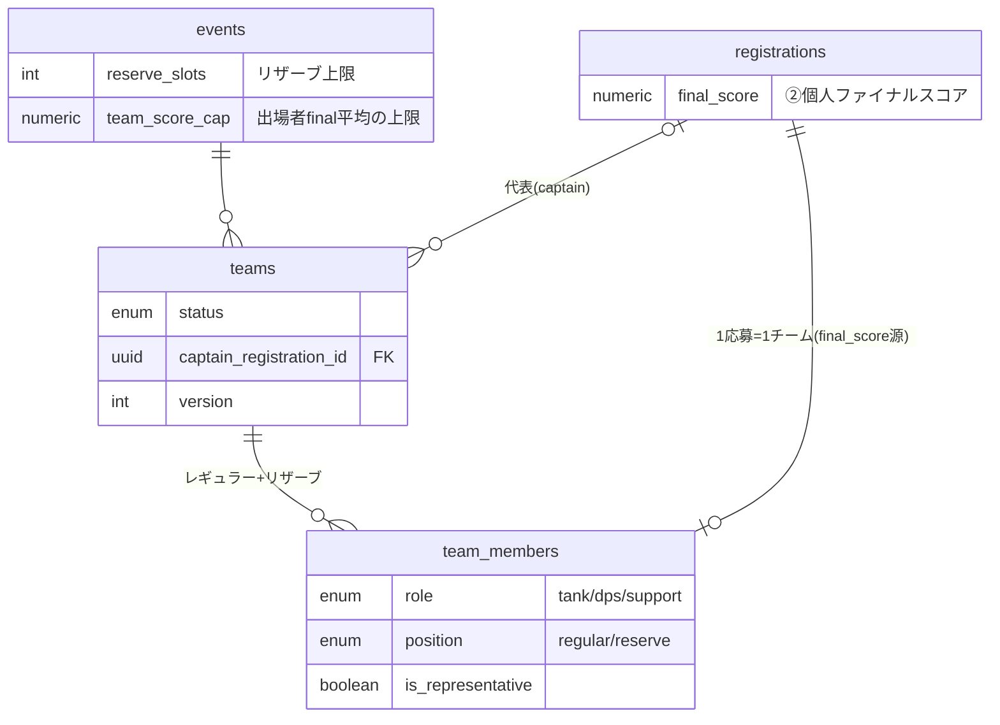
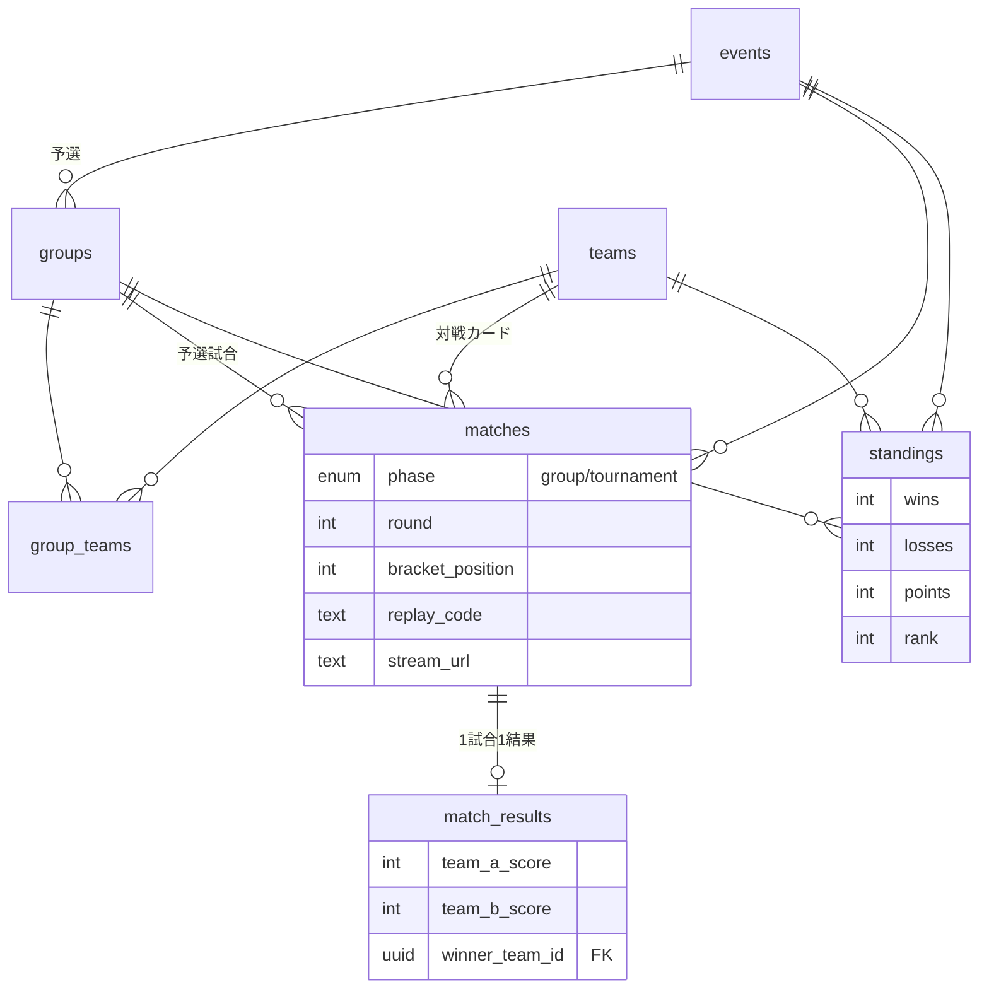
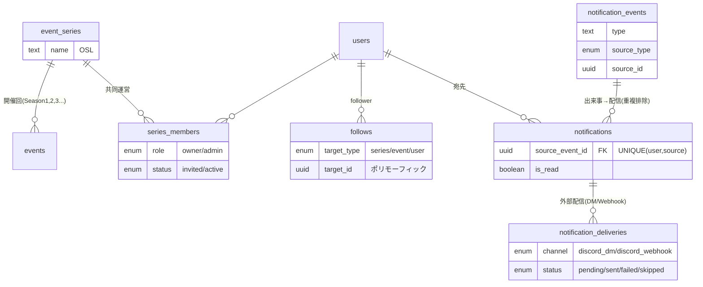

# GameEventBoard ER図

最終更新: 2026-06-18
ステータス: ドラフト（[DB設計書](./DB設計書.md) ベース）

Mermaid記法で記述。GitHub / VS Code（Markdown Preview Mermaid Support 等）でレンダリングされる。
属性は主要なキー・区分・特徴的な列に絞って記載（全列は [DB設計書](./DB設計書.md) を参照）。

---

## 1. 全体ER図

```mermaid
erDiagram
    users ||--o{ user_season_ranks : "申告する"
    users ||--o{ user_peak_achievement : "到達経験を持つ"
    users ||--o{ events : "主催する(organizer)"
    users ||--o{ registrations : "応募する"
    users ||--o{ follows : "フォローする(follower)"
    users ||--o{ notifications : "受け取る"
    users ||--o{ match_results : "結果を入力する(reported_by)"
    users ||--o{ event_series : "作成する(created_by)"
    users ||--o{ series_members : "運営に参加する"

    event_series ||--o{ events : "開催回を持つ"
    event_series ||--o{ series_members : "運営メンバー"
    event_series ||--o{ series_invites : "招待(将来)"

    notification_events ||--o{ notifications : "出来事から配信生成"
    notifications ||--o{ notification_deliveries : "外部配信(DM/Webhook)"
    teams ||--o{ scrims : "練習試合"

    games ||--o{ rank_definitions : "ランク定義を持つ"
    games ||--o{ events : "対象タイトル"
    games ||--o{ user_season_ranks : "タイトル別ランク"
    games ||--o{ user_peak_achievement : "タイトル別到達"

    rank_definitions ||--o{ user_season_ranks : "参照される"

    events ||--o{ event_tags : ""
    tags   ||--o{ event_tags : ""
    events ||--o{ event_form_fields : "カスタム質問を持つ"
    events ||--o{ registrations : "応募を受ける"
    events ||--o{ teams : "チームを持つ"
    events ||--o{ groups : "予選グループを持つ"
    events ||--o{ matches : "試合を持つ"
    events ||--o{ standings : "順位表を持つ"

    registrations ||--o{ registration_answers : "回答する"
    event_form_fields ||--o{ registration_answers : "回答される"
    registrations ||--o| team_members : "1チームに所属(最大1)"
    registrations |o--o{ teams : "代表者(captain)"

    teams ||--o{ team_members : "メンバーを持つ"
    teams ||--o{ group_teams : ""
    groups ||--o{ group_teams : ""

    groups ||--o{ matches : "予選試合(group)"
    teams  ||--o{ matches : "対戦カード(team_a/team_b)"
    matches ||--o| match_results : "結果(1試合1結果)"
    teams  ||--o{ match_results : "勝者(winner)"
    matches ||--o{ match_lineups : "出場メンバー(Phase2)"
    team_members ||--o{ match_lineups : "出場記録"

    groups ||--o{ standings : "グループ順位"
    teams  ||--o{ standings : "チームの順位"

    users {
        uuid id PK "= auth.uid"
        text discord_id UK
        text discord_name
        text battle_tag "必須(初回登録)"
        boolean is_admin
    }

    user_season_ranks {
        uuid id PK
        uuid user_id FK
        uuid game_id FK
        text season_label
        int season_order "新しいほど大"
        enum role "tank/dps/support"
        uuid rank_definition_id FK
    }

    user_peak_achievement {
        uuid user_id PK,FK
        uuid game_id PK,FK
        enum peak_tier "none/master/gm/champion"
    }

    games {
        uuid id PK
        text name UK
        enum_array roles
        int team_size
    }

    rank_definitions {
        uuid id PK
        uuid game_id FK
        text label "例:ブロンズ5"
        numeric score "例:1..40"
        int sort_order
    }

    tags {
        uuid id PK
        text name UK "例:初心者限定"
    }

    event_series {
        uuid id PK
        text name "例:OSL"
        uuid created_by FK
        text logo_url
    }

    series_members {
        uuid id PK
        uuid series_id FK
        uuid user_id FK
        enum role "owner/admin"
        enum status "invited/active"
    }

    series_invites {
        uuid id PK
        uuid series_id FK
        text token UK
        enum role
        timestamptz expires_at
    }

    events {
        uuid id PK
        uuid series_id FK "単発はnull"
        uuid game_id FK
        uuid organizer_id FK
        text organizer_display_name "主催者の登録名(nullでdiscord_nameにフォールバック)"
        text slug UK
        enum status
        int capacity "=チーム数"
        int current_count "排他制御対象"
        enum entry_type "individual/team/mixed"
        enum team_formation "self/organizer/none"
        boolean require_score
        boolean require_role
        int reserve_slots "リザーブ上限"
        numeric team_score_cap "出場者final平均の上限"
        int version "楽観ロック"
    }

    event_tags {
        uuid event_id PK,FK
        uuid tag_id PK,FK
    }

    event_form_fields {
        uuid id PK
        uuid event_id FK
        text label
        enum field_type "text/textarea/select/url/number"
        boolean is_required
        int sort_order
    }

    registrations {
        uuid id PK
        uuid event_id FK
        uuid user_id FK
        text display_name "応募者の登録名(nullでdiscord_nameにフォールバック)"
        enum preferred_role
        enum assigned_role
        boolean wants_matching "mixed時の分岐"
        enum status
        numeric individual_score "①基礎"
        numeric final_score "②=①+ボーナス"
        numeric organizer_override_score
    }

    registration_answers {
        uuid id PK
        uuid registration_id FK
        uuid field_id FK
        text value
    }

    teams {
        uuid id PK
        uuid event_id FK
        text name
        enum status "pending/approved/rejected"
        uuid captain_registration_id FK
        int version "楽観ロック"
    }

    team_members {
        uuid id PK
        uuid team_id FK
        uuid registration_id FK,UK "1応募=1チーム"
        enum role
        enum position "regular/reserve"
        boolean is_representative
    }

    groups {
        uuid id PK
        uuid event_id FK
        text name "例:グループA"
    }

    group_teams {
        uuid group_id PK,FK
        uuid team_id PK,FK
    }

    matches {
        uuid id PK
        uuid event_id FK
        enum phase "group/tournament"
        uuid group_id FK
        int round
        int bracket_position
        uuid team_a_id FK
        uuid team_b_id FK
        timestamptz scheduled_at
        text replay_code "OW"
        text stream_url
        timestamptz notified_at "Cron用"
    }

    match_lineups {
        uuid id PK
        uuid match_id FK
        uuid team_id FK
        uuid team_member_id FK
    }

    match_results {
        uuid match_id PK,FK
        int team_a_score
        int team_b_score
        uuid winner_team_id FK
        uuid reported_by FK
    }

    standings {
        uuid id PK
        uuid event_id FK
        uuid group_id FK "全体順位ならnull"
        uuid team_id FK
        int wins
        int losses
        int points
        int rank
    }

    follows {
        uuid id PK
        uuid follower_id FK
        enum target_type "series/event/user"
        uuid target_id "ポリモーフィック"
    }

    notification_events {
        uuid id PK
        text type
        enum source_type "series/event/user"
        uuid source_id
        jsonb payload
    }

    notifications {
        uuid id PK
        uuid user_id FK
        uuid source_event_id FK "UNIQUE(user,source)"
        text title
        boolean is_read
    }

    notification_deliveries {
        uuid id PK
        uuid notification_id FK
        enum channel "discord_dm/discord_webhook"
        enum status "pending/sent/failed/skipped"
    }

    scrims {
        uuid id PK
        uuid team_id FK
        timestamptz scheduled_at
        text opponent_name
        uuid opponent_team_id FK
    }
```



> **注: `follows.target_id` はポリモーフィック参照**（target_type に応じて event_series / events / users を指す）。
> RDBの外部キー制約では1テーブルしか指せないため、ER図上は users(follower) との関連のみFKで表現し、
> target への関連はアプリ層で担保する（DB設計書 3.17）。
> **通知は2層**: 出来事(`notification_events`)1件 → フォロワーを集約・ユニーク化して各人の配信(`notifications`)を生成。`UNIQUE(user_id, source_event_id)` で重複通知を物理的に防ぐ（DB設計書 5.1）。

---

## 2. ドメインごとの分割ビュー
全体図は大きいので、理解しやすいよう関心領域ごとに分けた図も用意する。

### 2.1 ユーザー＆ランク（プロフィール／スコアの源泉）


### 2.2 イベント＆応募（募集フォーム／参加表明）


### 2.3 チーム編成（振り分け／レギュラー・リザーブ／交代シミュレーション）

> チームスコア(③)は保存せず算出 = 出場(regular)メンバーの final_score 平均。リザーブは平均に含めない。
> 交代シミュレーション: リザーブを出す際、どのレギュラーと交代すれば team_score_cap 以内かを全パターン算出（DB設計書 4.3）。最大人数 = games.team_size + events.reserve_slots。

### 2.4 進行＆結果（予選グループ→トーナメント→順位）


### 2.5 シリーズ＆フォロー＆通知（SNS・継続購読）

> フォロー対象は series/event/user の3種。`follows` は target_id がポリモーフィック（FK制約なし、アプリ層で担保）。
> 「OSL Season3告知」のような出来事は `notification_events` に1件 → シリーズ/主催者/開催回の各フォロワーを集約しユニーク化 → `notifications` に1人1件。`UNIQUE(user_id, source_event_id)` で重複通知を防ぐ。
> **配信の二段構え**: アプリ内通知(notifications)は必ず残し、`notification_deliveries` で Discord DM(個人向け)/Webhook(全体向け) への外部配信を記録。DM拒否などは status=skipped で記録し取りこぼしを把握（要件 3.5.2）。

---

## 3. 関連の読み解き（カーディナリティ補足）
- `||--o{` = 1対多（左が1、右が多）。`||--o|` = 1対0/1。`|o--o{` = 0/1対多。
- **1イベント → 多応募 → （振り分けで）多チーム**。1応募は最大1チームにしか入らない（`team_members` UNIQUE(registration_id)）。
- **個人スコアの源泉**: `users` → `user_season_ranks`（シーズン×ロール）＋ `user_peak_achievement`、これを応募時に集計し `registrations.individual_score` にスナップショット。
- **チームの作られ方の二系統**:
  - self応募: `teams` が応募主体（status で承認）、代表は `captain_registration_id`。
  - organizer振り分け: 運営が `teams` を作り `team_members` に割当（即approved）。
- **試合の二系統**: `matches.phase` で予選(group)/決勝(tournament)を区別。予選は `group_id` を持つ。
- **シリーズと開催回**: `event_series`（継続企画）→ `events`（開催回）の1対多。単発イベントは series_id=null。継続して追いたい対象はシリーズをフォローする。
- **シリーズの共同運営**: `series_members`（owner/admin、invited→active）。検索招待＋本人承認。
- **通知の重複排除**: 出来事(`notification_events`)起点で宛先を集約・ユニーク化し、`notifications` の UNIQUE(user,source) で二重通知を防ぐ。
- **ポリモーフィック**: `follows` はシリーズ/イベント/ユーザーをフォローできる（target_type＋target_id、FK制約なし）。

---

## 4. 未確定・ER図に影響しうる点
- `standings` をテーブル実体で持つかビューにするか（DB設計書 §7）。ビュー化する場合はER図から実体テーブルを外す。
- トーナメントの bracket 構造を round/bracket_position で表現するか、専用テーブルに分けるか（試合数が多い大会で要検討）。
```
