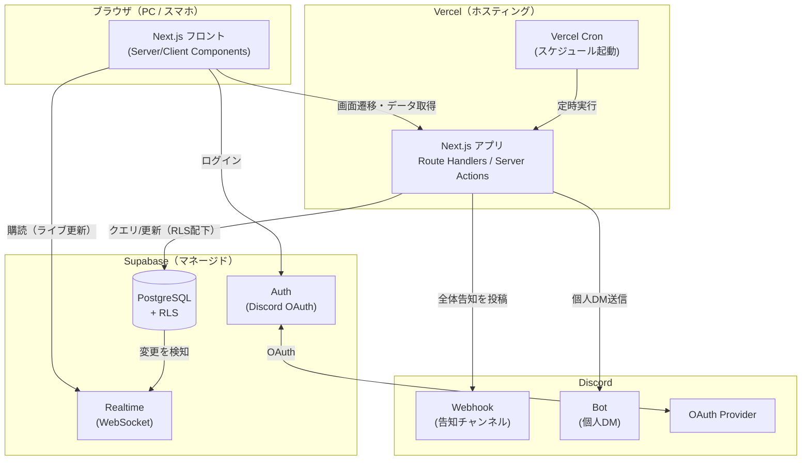
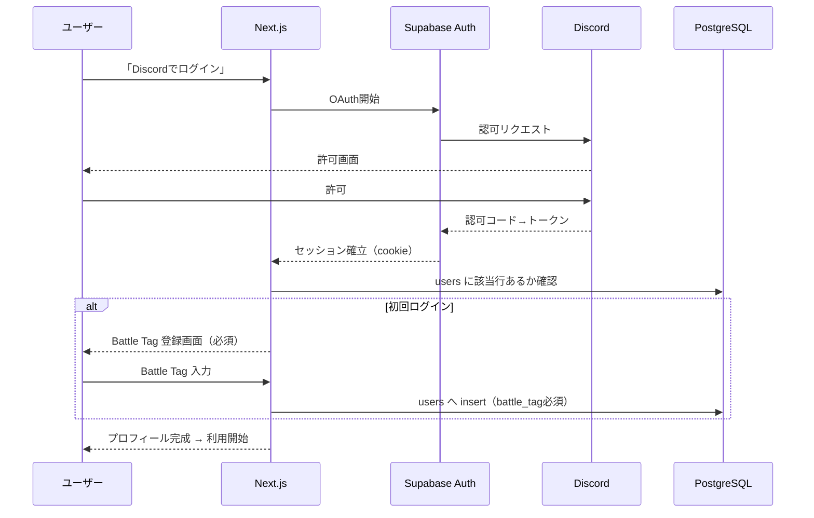
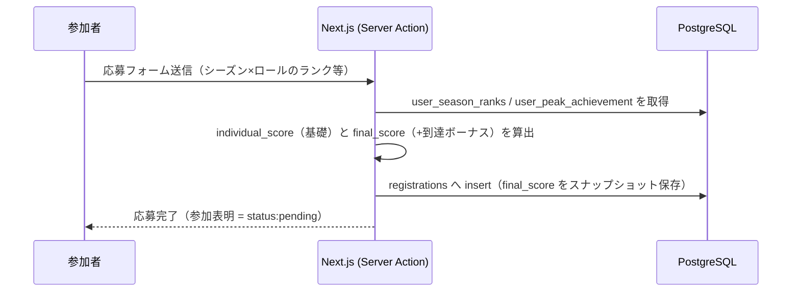
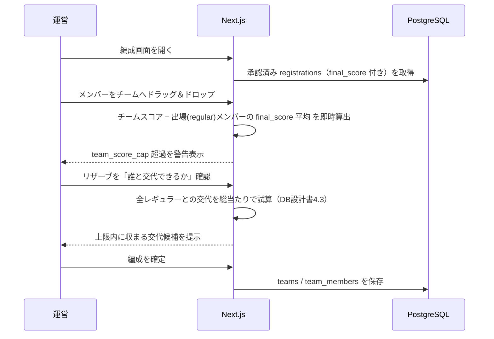
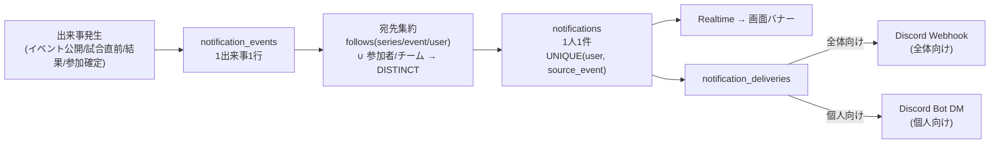
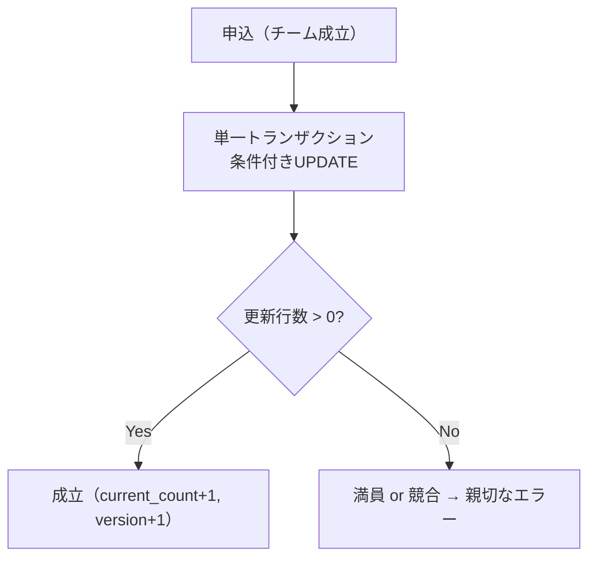

# GameEventBoard アーキテクチャ設計書

最終更新: 2026-06-18
ステータス: ドラフト（設計確定分を反映）

関連: [要件定義書](./要件定義書.md) / [DB設計書](./DB設計書.md) / [ER図](./ER図.md) / [devlog](./devlog.md)

この文書は **「どう作るか（How）」の全体像** を集約する。What/Why は要件定義書、データ構造の詳細はDB設計書を正とし、本書は重複を避けてアーキテクチャの意思決定と構造に集中する。

---

## 1. システム構成（全体像）

### 1.1 構成図


### 1.2 各レイヤーの責任範囲
| レイヤー | 担当 | 備考 |
|---------|------|------|
| Next.js フロント | 画面描画・入力・Realtime購読 | Server/Client Components 併用 |
| Next.js サーバー（Vercel） | API（Route Handlers）・サーバー処理（Server Actions）・振り分け計算・通知発火 | サーバーレス（短命） |
| Vercel Cron | 「21時に通知」等のスケジュール起動 | 関数を定時に叩くだけ |
| Supabase Auth | 認証（Discord OAuth） | セッションはcookieで管理 |
| Supabase PostgreSQL | データ永続化・RLSによる認可・排他制御 | アプリの「正」 |
| Supabase Realtime | DB変更の全クライアントへのpush | WebSocketはSupabaseが常時保持 |
| Discord Webhook | 全体告知（チャンネル投稿） | Bot不要 |
| Discord Bot | 個人向けDM | 要Bot作成・サーバー導入 |

> **設計思想**: サーバーレスでリアルタイム通信は「関数で持たず Supabase Realtime に任せる」。スケジュール処理は「Cronが関数を叩く」。それぞれ別レイヤーに分離している（要件 3.5）。

### 1.3 技術スタックと選定理由（要約）
| レイヤー | 技術 | 理由（詳細は要件定義書4.1） |
|---------|------|------|
| フレームワーク | Next.js 16 (App Router) + TypeScript | フルスタック・型の一気通貫・1人開発に最適 |
| UI | Tailwind v4 + shadcn/ui | 高速に整ったUI |
| DB/認証/Realtime | Supabase (PostgreSQL) | 3つが一体・無料枠 |
| ホスティング | Vercel | Next.jsと密・push→自動デプロイ |
| 定期実行 | Vercel Cron | スケジュール通知 |
| 通知 | Discord Webhook / Bot | コミュニティ連携 |

**フルスタック（バックエンド非分離）の根拠**: バックエンドが薄い／1人開発／型の一気通貫／無料枠の単純さ。重い処理が出たら Supabase Edge Functions / Cron に切り出す（早すぎる分離を避ける）。

---

## 2. データフロー / 処理フロー

主要ユースケースのリクエスト→DB→外部連携の流れ。

### 2.1 認証（Discord OAuth ＋ 初回プロフィール）


### 2.2 応募 → 個人スコア算出（スナップショット）

> 算出ロジックの詳細は DB設計書 4.1。イベント設定（role_swap_allowed / declared_seasons / bonus_*）で算出方式が変わる。

### 2.3 チーム編成・交代シミュレーション（このアプリの中核）

> チームスコアは保存せず常に算出。交代シミュレーションがOSL運営の手作業を自動化する価値の中核。

### 2.4 通知（出来事起点・重複排除・二段配信）

- **重複排除**: 出来事起点で宛先を集約・ユニーク化。`UNIQUE(user_id, source_event_id)` でDBが二重通知を物理的に防ぐ（冪等）。
- **二段配信**: アプリ内（必ず残る）＋ 外部（Discord）。個人向けはDM、全体向けはWebhook。DM拒否は `delivery_status=skipped` で記録し取りこぼしを把握。
- **スケジュール系**（「21時から試合」）は Vercel Cron が発火 → 出来事生成 → 上記フロー。

### 2.5 同時申込の排他（チーム枠）

- 楽観的ロック（version）＋ `current_count < capacity` の条件付きUPDATE。最終防衛に CHECK制約と UNIQUE制約。詳細は DB設計書 5。

---

## 3. ディレクトリ構成・コード方針

### 3.1 ディレクトリ構成（現状 → 想定）
```
GameEventBoard/
├── docs/                       設計ドキュメント（本書もここ）
├── supabase/
│   └── migrations/             DB マイグレーション SQL（0001〜）
├── src/
│   ├── app/                    App Router（ルーティング＝URL構造）
│   │   ├── (auth)/             認証関連ルート（ログイン・初回登録）  ※想定
│   │   ├── events/             イベント一覧・詳細・作成  ※想定
│   │   ├── series/             シリーズ  ※想定
│   │   ├── api/                Route Handlers（外部webhook受け等）  ※想定
│   │   ├── layout.tsx
│   │   └── page.tsx
│   ├── components/
│   │   └── ui/                 shadcn/ui（汎用UI部品）
│   ├── features/               機能単位のコンポーネント・ロジック  ※想定
│   │   ├── events/
│   │   ├── teams/              チーム編成・交代シミュレーション
│   │   └── notifications/
│   └── lib/
│       ├── supabase/
│       │   ├── client.ts       ブラウザ用クライアント
│       │   ├── server.ts       サーバー用クライアント（async cookies）
│       │   └── types.ts        DBスキーマから自動生成した型（gen types）  ※想定
│       ├── services/           Service層（ロジック: スコア算出・交代シミュレーション等）  ※想定
│       ├── repositories/       Repository層（DBアクセスを集約）  ※想定
│       └── utils.ts
```
> `※想定` は今後追加していく構造。機能が増えたら `features/<機能>` に凝集させ、`app/` はルーティングに徹する。
> 層構造（Controller/Service/Repository）の方針は 3.5、データアクセス手段は 3.3 を参照。

### 3.2 Server / Client コンポーネントの使い分け
| 種別 | 使う場面 | 例 |
|------|---------|-----|
| **Server Component**（既定） | データ取得・表示が中心、インタラクション少 | イベント一覧、順位表、試合スケジュール |
| **Client Component**（`"use client"`） | 状態・イベントハンドラ・Realtime購読が必要 | チーム編成（D&D）、応募フォーム、通知バナー |

原則: **既定はServer**。Clientは「インタラクティブな葉」に閉じる（ツリーの上位をClientにしない）。

### 3.3 データアクセスの方針
| 操作 | 手段 | クライアント |
|------|------|------------|
| 読み取り（表示） | Server Component から直接クエリ | `lib/supabase/server.ts` |
| 変更（フォーム送信・編成確定） | **Server Actions** | `lib/supabase/server.ts` |
| ライブ更新の購読 | Client Component で購読 | `lib/supabase/client.ts` |
| 外部からの受信（将来） | Route Handler（`app/api/...`） | 用途に応じ |

- 重い計算（スコア算出・交代シミュレーション）は**サーバー側**で行う。
- Service Role キーは**サーバーの管理処理でのみ**使用し、通常フローでは使わない（RLSを効かせる）。

#### ORM / データアクセス手段の選定（確定）
**方針: Supabaseクライアント（クエリビルダー）＋ 型自動生成。Prisma等の追加ORMは不採用。**

- Supabaseクライアントは `.from().select().eq()` 形式のクエリビルダーで、SQL文字列を手書きしない（ORMの「SQLを書かずに済む」役割を兼ねる）。
- 型安全は **`supabase gen types typescript`** でDBスキーマからTS型を自動生成して補う（`lib/supabase/types.ts`）。Prismaに近い型安全を追加ライブラリなしで得る。

**Prisma を入れない理由（トレードオフ）**
| 観点 | Prisma を足すと | 本プロジェクトの判断 |
|------|----------------|---------------------|
| RLS との相性 | Prismaは直接DBに繋ぎ、ユーザーセッションを通さないため **RLSをすり抜けやすい** | 本設計はRLSを最終防衛の柱にしている（4.2）。Supabaseクライアントは**ユーザーのセッションを引き継ぎRLS配下で動く**ため設計と一致 |
| Auth / Realtime | 別系統になり二重管理 | Supabaseクライアントは Auth/Realtime と自然に繋がる |
| マイグレーション | Prisma schema と Supabase で **二重管理**になりがち | マイグレーションは `supabase/migrations/*.sql` 一本に統一 |
| 型安全 | 強力（schemaから生成） | `gen types` でほぼ同等を確保でき、Prismaの主目的は代替可能 |

> 結論: Prismaの主な利点（型安全）は型生成で取り込み、Supabaseの恩恵（RLS/Realtime/Auth）を壊さない。**Supabaseを「ただのDB」として使うならPrismaも有効**だが、本プロジェクトはSupabaseの機能を活用するため不採用。

### 3.4 命名・規約
- テーブル: 複数形スネークケース、PK=`id`(uuid)、FK=`<対象単数>_id`、日時=`created_at`/`updated_at`（DB設計書0準拠）。
- ブランチ: `feature/xxx`、1機能=1PR、コミット・PR・devlogは日本語（CLAUDE.md準拠）。
- **Next.js 16系は破壊的変更あり**。実装前に `node_modules/next/dist/docs/` を確認（AGENTS.md）。

### 3.5 層構造とテスト方針

#### 層構造（Controller / Service / Repository）
従来の三層構造を Next.js フルスタックに対応させる。フロント/バックの「デプロイ境界」とは独立した、**コードの責務分割**として適用する。
| 層 | 役割 | 置き場所 |
|----|------|---------|
| **Controller** | 入口。入力検証して Service を呼ぶだけ（薄い） | Server Action（`app/<機能>/actions.ts`） / Route Handler（`app/api/...`） |
| **Service** | ビジネスロジック（計算・判断）。DBに依存しない純粋な処理を志向 | `lib/services/` |
| **Repository** | DBアクセスを集約（Supabaseクライアント経由） | `lib/repositories/` |

```
[Controller] app/events/actions.ts        フォーム送信を受ける → 検証 → service呼び出し
      ↓
[Service]    lib/services/scoring.ts       個人スコア算出・交代シミュレーション（純粋ロジック）
      ↓
[Repository] lib/repositories/registrations.ts   registrations への CRUD（Supabaseクライアント）
```

- **Controllerは薄くなる**: Server Actions がHTTPの窓口仕事（fetch/パース/ルーティング）を自動化するため、Controllerは「検証して呼ぶだけ」。
- **Repositoryの中身はSupabaseクライアント**（Prismaではない、3.3）。「DBアクセスを集約する」思想は従来通り。

#### メリハリ（過剰な層分けを避ける）
| 処理の性質 | 層分け |
|-----------|--------|
| 複雑なロジック（スコア算出・交代シミュレーション・振り分け） | ✅ Service に切り出してテスト |
| 単純なCRUD・表示のみ（タグ一覧取得など） | △ Server Component から直接クエリで可。過剰に分けない |

> Next.js のバックエンドは薄いため、全機能を厳格に3層化するとオーバーエンジニアリング。**複雑ロジックは層分け＋テスト、単純CRUDは薄く**。

#### テスト方針
- **テスタブルにするための層構造**であり、TDD（テストを先に書く進め方）の採用は必須としない。テストは書くが、書く順序は自由。
- **単体テスト（主役）**: `lib/services/` の純粋ロジック。DBに繋がないため高速・安定。
  - 例: `scoring.calcFinalScore()` / `swapCandidates()`（プロトタイプの `data.ts` が既にこの形）。
- **結合テスト**: Server Action〜Repository〜DBの流れ。テスト用Supabase（ローカル or 専用プロジェクト）に対して実行。
- 重い計算をServiceに寄せておくことが、単体テストの書きやすさに直結する（3.3の「重い計算はサーバー側」と一貫）。
- テストランナー等の具体は実装着手時に選定（未確定、5章）。

---

## 4. 認証・認可（RLS）・セキュリティ

### 4.1 認証（Authentication）
- **Discord OAuth のみ**（メール/パスワードは扱わない）。`auth.users` と `public.users` を `id` で1:1対応。
- 「識別 vs 認証」を分離: Discord ID＝認証＋識別、Battle Tag＝プロフィール（識別・表示用、認証には使わない）。
- 初回ログイン時に Battle Tag 登録を必須化（未登録は応募不可をアプリ側で制御）。

### 4.2 認可（Authorization） — 2層で守る
| 層 | 役割 | 例 |
|----|------|-----|
| **アプリ層** | 画面・操作の出し分け、親切なエラー | 運営でなければ編集ボタンを出さない |
| **DB層（RLS）** | 最終防衛。アプリがすり抜けても守る | RLSポリシーで他人のイベントを更新不可に |

> 排他制御・通知重複排除と同じ思想で「**DBで最終防衛**」。アプリ層だけに頼らない。

### 4.3 RLS 方針（テーブル別の概要）
全テーブルで RLS を有効化済み（migration 0001）。デフォルト拒否（ポリシー未定義＝不可）から始め、0002以降でポリシーを定義する。
| テーブル | 参照 | 変更 |
|---------|------|------|
| users | 公開情報のみ | 本人のみ |
| event_series / series_members | 公開 | `series_members(active)` のみ。owner のみ運営追加削除・削除 |
| events | published は全員 | 該当シリーズ運営 or organizer |
| registrations | 本人＋該当イベント運営 | 同左 |
| matches / results / standings | 公開 | 運営 |
| follows / notifications | 本人のみ | 本人のみ |
| `is_admin` | — | 全権限のエスケープハッチ |

### 4.4 権限ロール（シリーズ運営）
- `series_members.role`: `owner`（全権限：運営追加削除・シリーズ削除）/ `admin`（イベント運営業務）。
- 招待は検索招待＋本人承認（`status: invited→active`）。権限付与に本人同意を要求。

### 4.5 秘密情報・キーの扱い
| キー | 置き場所 | 露出 |
|------|---------|------|
| `NEXT_PUBLIC_SUPABASE_URL` / `ANON_KEY` | `.env.local`（公開可） | ブラウザに出てよい（RLS前提） |
| `SUPABASE_SERVICE_ROLE_KEY` | `.env.local`（サーバー専用） | **絶対にクライアントに出さない** |
| Discord Bot トークン / Webhook URL | `.env.local` or DB（webhook url） | サーバーのみ |
- `.env*` は `.gitignore` 済み。`.env.local.example` で項目だけ共有。
- Service Role はRLSを無視する強力な鍵。管理用処理に限定。

### 4.6 ポリモーフィック参照の注意（follows）
`follows.target_id` は series/event/user を指すため**FK制約を張れない**。参照整合性はアプリ層で担保する（DB設計書 3.17）。削除時の整合（フォロー対象が消えた場合）はアプリ側でハンドリングする。

---

## 5. 未確定 / 今後アーキテクチャに影響しうる点
- RLSポリシー本体（0002マイグレーション）の具体記述。
- ~~Discord Bot のホスティング方式（常駐 or Vercel関数からBot APIを叩く）。~~ → **確定（2026-07-07）**: 送信専用のため**非常駐**。Vercel の関数（Cron / Server Action）から Discord REST API を都度叩く（`DISCORD_BOT_TOKEN`）。DM の受信・スラッシュコマンド応答は行わないので常駐ゲートウェイ接続は不要。将来ユーザー↔Bot の対話機能をやる場合に初めて別プロセス常駐を検討する。
- Cron の具体ジョブ設計（試合直前通知の発火タイミング・冪等性）。
- `standings` をテーブル実体にするかビューにするか（Realtimeとの兼ね合い）。
- 重い処理が出た場合の Supabase Edge Functions への切り出し基準。
- テストランナー・結合テスト用DB環境の選定（3.5）。
